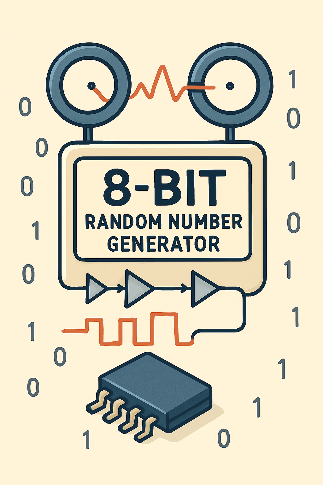
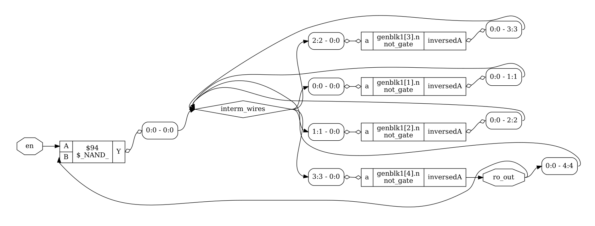
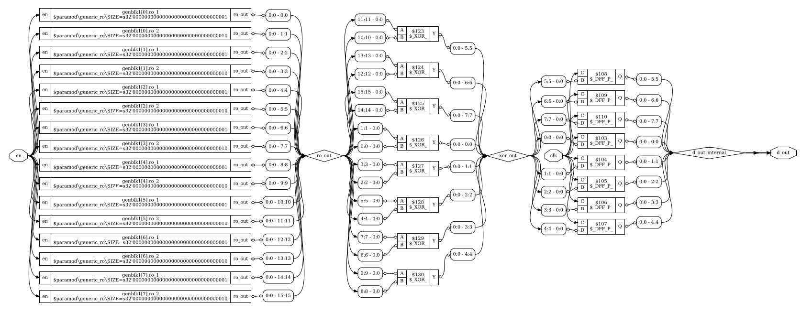
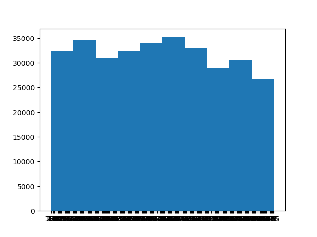

  

> [!NOTE]  
> This design was created during the Hackathon of the 2024 FPGA Ignite Summer school in Heidelberg

# 8-bit RNG generator
For a random number generator a source of Entropy is needed.
In this case the randomness comes from the phase jitter in the ROs, which is influenced by thermal noise and other unpredictable physical effects.

One ring oscillator structure:

  

Here are multiple ring oscillators put together to one 8-bit RNG:

  

## FPGA Prototyping
Hello everyone,

this module seems to work - kind of :)
The quality of randomness will be interesting to observe!

On FPGA the numbers look somewhat random however there seem to be some trends towards some numbers.
You can use the Vivado project along with a Basys3 board to verify that.
The FPGA sends the generated 8-bit numbers via UART and they are dumped into a file on the host side using a python script.
Using a second Python script the histogram file seen in the py filder can be observed.

The following plot shows the distribution of 8-bit numbers from 0 to 255:

  

## Files needed for the design
This design is very minimal
- trng_top.v
- generic_ro.v
- notGate.v

## SoC Integration
We think it would be best to connect the design with its only 10 IOs to the system.
This will allow the overall system to leverage this RNG source. For example to generate cool patterns on a VGA design block.

IOs to system are:
- Enable bit
- Clock
- 8x data

## Reading material
It is best to familiarize yourself with the generation of random numbers through reading about the concept

See:
- https://core.ac.uk/download/pdf/144146883.pdf
- https://cas.cnu.ac.kr/wp-data/international_conference/[2021]%20Analysis%20of%20Ring-Oscillator-based%20True%20Random%20Number%20Generator%20on%20FPGAs.pdf